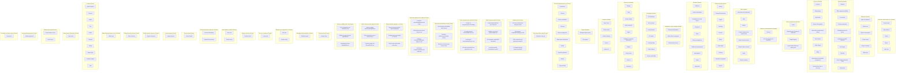

# Programmatic IA Overview

This Mermaid diagram was generated directly from the Visual Hierarchy JSON without AI!

```mermaid
flowchart TD
    subgraph H_0 ["Financial infrastructure to gr (Header)"]
        H_0_0["Contact sales"]
        H_0_1["Sign inSign in"]
        H_0_2["Pricing"]
        H_0_3["Sign in"]
        H_0_4["Start now"]
    end
    subgraph H_1 ["Main Nav (Header)"]
        H_1_0["Stripe for platforms"]
        H_1_1["Watch now"]
        H_1_2["Stripe for enterprises"]
        H_1_3["Contact sales"]
        H_1_4["Stripe for startups"]
        H_1_5["Stripe logo"]
    end
    subgraph H_3 ["Payments (Header)"]
        H_3_0["Platforms"]
        H_3_1["Offer usage-based billing"]
        H_3_2["E-commerce"]
        H_3_3["Finance automation"]
        H_3_4["Hospitality travel and leisure"]
        H_3_5["Implement a prebuilt checkout"]
        H_3_6["Get support"]
        H_3_7["Checkout"]
        H_3_8["Issue stablecoin-backed cards"]
        H_3_9["Enterprises"]
    end
    subgraph H_4 ["Revenue (Header)"]
        H_4_0["Invoicing"]
        H_4_1["Subscriptions"]
        H_4_2["Metronome"]
        H_4_3["Revenue Recognition"]
        H_4_4["Metronome Usage-based billing"]
        H_4_5["Data Pipeline"]
        H_4_6["Stripe Sigma"]
        H_4_7["Billing"]
        H_4_8["Subscriptions Subscription management"]
        H_4_9["Invoicing One-time or recurring"]
    end
    subgraph H_5 ["Money management (Header)"]
        H_5_0["Crypto"]
        H_5_1["Global Payouts Payouts to third parti"]
        H_5_2["Global Payouts"]
        H_5_3["Crypto Wallet stablecoin issuing and"]
    end
    subgraph H_6 ["Platforms and marketplaces (Header)"]
        H_6_0["Connect"]
        H_6_1["Connect Payments for platforms"]
    end
    subgraph H_7 ["More (Header)"]
        H_7_0["Atlas Start-up incorporation"]
        H_7_1["Atlas"]
        H_7_2["Climate"]
        H_7_3["Product roadmap See whats ahead"]
        H_7_4["Radar Fraud prevention"]
        H_7_5["Climate Carbon removal"]
        H_7_6["Radar"]
        H_7_7["Product roadmap"]
    end
    subgraph H_8 ["Products  pricing (Header)"]
        H_8_0["Issuing"]
        H_8_1["Financial Connections"]
        H_8_2["English"]
        H_8_3["Invoicing"]
        H_8_4["Connect"]
        H_8_5["Radar"]
        H_8_6["Stripe Sigma"]
        H_8_7["Treasury"]
        H_8_8["Revenue Recognition"]
        H_8_9["Payouts"]
    end
    subgraph H_9 ["Solutions (Header)"]
        H_9_0["Platforms"]
        H_9_1["Finance automation"]
        H_9_2["Hospitality travel and leisure"]
        H_9_3["Enterprises"]
        H_9_4["Retail"]
        H_9_5["Money management"]
        H_9_6["Media and entertainment"]
        H_9_7["Marketplaces"]
        H_9_8["Crypto"]
        H_9_9["Non-profits"]
    end
    subgraph H_10 ["Integrations  custom solution (Header)"]
        H_10_0["Stripe App Marketplace"]
        H_10_1["Stripe Partner ecosystem"]
        H_10_2["Professional services"]
    end
    subgraph H_11 ["Developers (Header)"]
        H_11_0["API changelog"]
        H_11_1["API reference"]
        H_11_2["Documentation"]
        H_11_3["API status"]
        H_11_4["Developer blog"]
        H_11_5["Stripe Projects"]
        H_11_6["Libraries and SDKs"]
    end
    subgraph H_12 ["Resources (Header)"]
        H_12_0["Sitemap"]
        H_12_1["Blog"]
        H_12_2["Cookie settings"]
        H_12_3["More resources"]
        H_12_4["Sign in"]
        H_12_5["Prohibited  restricted businesses"]
        H_12_6["Guides"]
        H_12_7["Privacy  terms"]
        H_12_8["Licences"]
        H_12_9["Community"]
    end
    subgraph H_13 ["Company (Header)"]
        H_13_0["Stripe Press"]
        H_13_1["Contact sales"]
        H_13_2["Product roadmap"]
        H_13_3["Careers"]
        H_13_4["Newsroom"]
    end
    subgraph H_14 ["Support (Header)"]
        H_14_0["Managed support plans"]
        H_14_1["Get support"]
    end
    subgraph F_0 ["Financial infrastructure to gr (Footer)"]
        F_0_0["E-commerce"]
        F_0_1["Connect"]
        F_0_2["Finance automation"]
        F_0_3["Treasury"]
        F_0_4["Money management"]
        F_0_5["Media and entertainment"]
        F_0_6["Guides"]
        F_0_7["Capital for platforms"]
        F_0_8["Identity"]
        F_0_9["Payment links"]
    end
    subgraph F_1 ["Start using Stripe today (Footer)"]
        F_1_0["Continue to sign up"]
    end
    subgraph F_2 ["Global access (Footer)"]
        F_2_0["135 currenciesProcess charges and dis"]
        F_2_1["100 payment methodsFrom Alipay to iDE"]
        F_2_2["195 countriesAccept payments around th"]
        F_2_3["1 integrationAccept payments globally"]
    end
    subgraph F_3 ["Built-in fraud prevention (Footer)"]
        F_3_0["Fraud analyticsMonitor your fraud perf"]
        F_3_1["Adapts to new fraud patternsAdapt fast"]
        F_3_2["No integration requiredGet started wit"]
        F_3_3["Powerful machine learningDetect and bl"]
    end
    subgraph F_4 ["Tools to optimise your checkou (Footer)"]
        F_4_0["Flexible UI componentsUse UI building"]
        F_4_1["Pre-built payment formsEmbed a pre-bui"]
        F_4_2["Accelerated checkoutAutofill your cust"]
        F_4_3["No-code paymentsAccept payments in min"]
    end
    subgraph F_5 ["Payments optimisations to boos (Footer)"]
        F_5_0["Auto-updated cardsUpdate card informat"]
        F_5_1["Customer authenticationVerify a custom"]
        F_5_2["Real-time retriesIncrease revenue with"]
    end
    subgraph F_6 ["Embedded payments for platform (Footer)"]
        F_6_0["Seamless onboardingOnboard and verify"]
        F_6_1["Risk toolsAccess tools to help you mit"]
        F_6_2["Platform managementManage payment oper"]
        F_6_3["Embedded componentsEmbed and white lab"]
    end
    subgraph F_7 ["Fast predictable payouts to y (Footer)"]
        F_7_0["Payout transparencySee upcoming payout"]
        F_7_1["Flexible payout optionsOpt to receive"]
        F_7_2["Like-for-like settlementIn selected re"]
    end
    subgraph F_8 ["Phone chat and email support (Footer)"]
        F_8_0["Industry-leading documentationBuild us"]
        F_8_1["24x7 supportOur team is here to help o"]
        F_8_2["Technical support on DiscordChat to ou"]
    end
    subgraph F_9 ["Security reliability and comp (Footer)"]
        F_9_0["PCI compliantUse our libraries to coll"]
        F_9_1["99999 average historical uptimeMaxim"]
        F_9_2["Regulatory licences globallyStripe is"]
    end
    subgraph F_10 ["Custom pricing (Footer)"]
        F_10_0["Contact sales"]
    end
    subgraph F_11 ["Integrating Stripe provides a (Footer)"]
        F_11_0["Read the report"]
    end
    subgraph F_12 ["Ready to get started Get in t (Footer)"]
        F_12_0["Start now"]
        F_12_1["Contact sales"]
    end
    subgraph F_13 ["See our customers (Footer)"]
        F_13_0["Learn more"]
    end
    subgraph F_14 ["Explore the docs (Footer)"]
        F_14_0["Read the docs"]
    end
    subgraph F_15 ["SaaS platforms solution (Footer)"]
        F_15_0["Start now"]
        F_15_1["Contact sales"]
    end
    subgraph F_16 ["Onboard customers with just a (Footer)"]
        F_16_0["Connect Onboarding"]
        F_16_1["Financial Connections"]
    end
    subgraph F_17 ["Extend capital (Footer)"]
        F_17_0["Stripe Capital"]
    end
    subgraph F_18 ["Instant payouts (Footer)"]
        F_18_0["Instant payouts"]
    end
    subgraph F_19 ["Enable agentic commerce (Footer)"]
        F_19_0["Agentic commerce"]
    end
    subgraph F_20 ["Embed financial services (Footer)"]
        F_20_0["Stripe Treasury"]
    end
    subgraph F_21 ["Embed financial services on yo (Footer)"]
        F_21_0["Watch now"]
    end
    subgraph F_22 ["Products (Footer)"]
        F_22_0["Instant Payouts"]
        F_22_1["Connect"]
        F_22_2["Capital"]
        F_22_3["Tax"]
        F_22_4["Radar"]
        F_22_5["Terminal"]
        F_22_6["Billing"]
        F_22_7["Stripe Sigma"]
        F_22_8["Premium Support"]
        F_22_9["Link"]
    end
    subgraph F_23 ["Stripe Partner Ecosystem (Footer)"]
        F_23_0["Learn more"]
    end
    subgraph F_24 ["Ready to get started (Footer)"]
        F_24_0["Create Stripe account"]
        F_24_1["Get in touch"]
    end
    subgraph F_25 ["Accept global payments (Footer)"]
        F_25_0["Explore payments"]
    end
    subgraph F_26 ["Get help from Stripe experts (Footer)"]
        F_26_0["Learn more"]
    end
```
